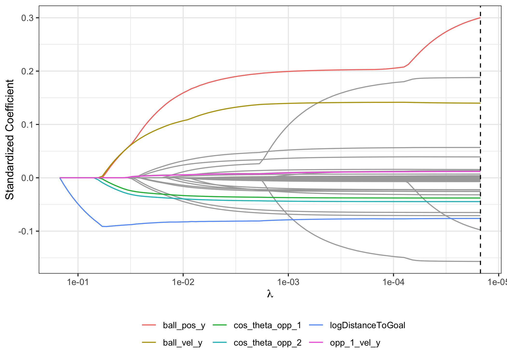
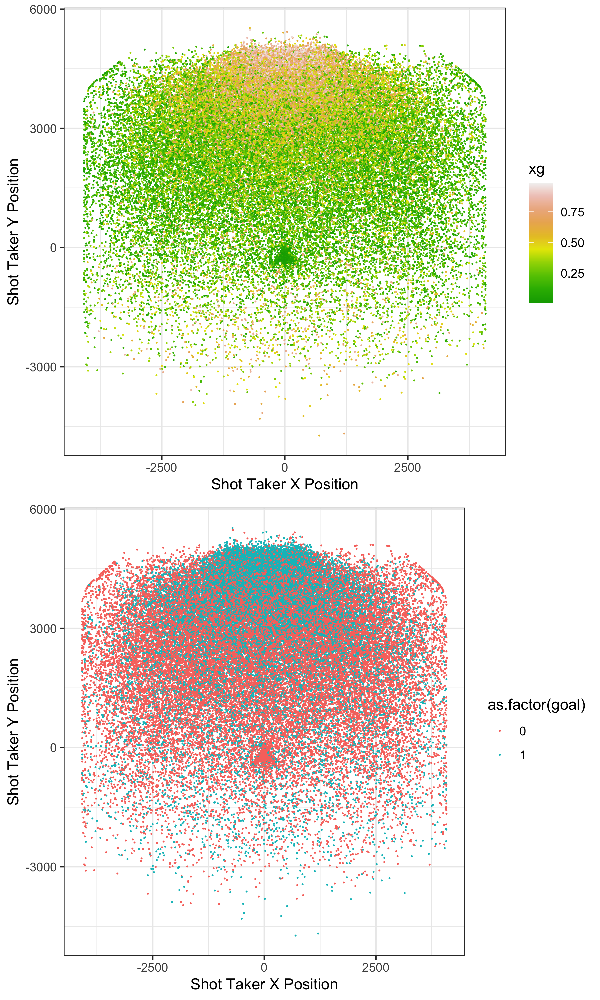

```{r setup, include=FALSE, message = FALSE}
options(scipen = 0, digits = 3)  # controls number of significant digits printed
library(tidyverse)
library(kableExtra)
```


```{r coverpage, out.width = "60%", fig.align='center', echo = FALSE, fig.pos = "H"}
knitr::include_graphics("../results/coverpage.jpeg")
```

\bigskip

\newpage

# Executive Summary

Rocket League is a multi-platform game where players control cars with a rocket booster and aim to score as many goals as possible within 5 minutes using an oversized ball. The ball never leaves the field and is a team game, but for our analysis, we focused on 2 versus 2 player mode. Players have the ability to control the direction, velocity, and rotation of their cars and can jump to hit the ball. This allows players the ability to take shots or control the car to dribble, pass, and block incoming shots.

Our dataset includes random frames of 2 versus 2 player Rocket League games that includes location data of all 4 players, car features, ball position, and whether or not a particular shot resulted in a goal. The dataset is from [Ball Chasing](ballchasing.com), which includes data from various Rocket League game replays.

For our analysis, we built an expected goals (xG) model using location data to predict goals for a given frozen game frame. xG is important in that it is an estimator of goals a team is expected to score in the long run. Using the xG model, we were able to explore individual play styles and understand characteristics of the top two Rocket League championship players. 

We found the following insights:

1. Outperformance, defined by the total goals scored divided by the sum of the player's xG, is not correlated with average xG, suggesting that there is no relationship between how many "excess" goals a player can score based on what we would expect given positioning features, and the average positioning across all of the player's attempts.

2. Players rarely adopt a strictly offensive or strictly defensive position. Most play styles involve moving around the field and adopting a dynamic play style.

3. Between the top 2 Rocket League champions, [ ]

\newpage

# Data Source
We obtained our data from [Ball Chasing](ballchasing.com), which is a website that records various Rocket League game replay data, along with the carball Python package that combines various tools for decompiling Rocket League replays. For our expected goals model, our raw dataset included random frames from 4,328 Rocket League 2v2 games over Platinum 3 level, which yielded 657,897 frames in total. For our analysis of the top two Rocket League champions, we scraped data from Ball Chasing. 

# Data Cleaning
Because our analysis is on intended shot attempts, we filtered the data for frames that included shot attempts only, which yielded 60,341 observations that we used for our expected goals models. While the raw dataset included various features, such as car features (like dodging, double jumping, ball cam), we transformed the dataset to include location data (ball, shot taker, teammate, and both opponent's locations) and various velocity measurements. 

# Exploratory Data Analysis
## Field Set Up
As a first step, we explored the location data to get a sense of the placement of the goal. Based on Figure \@ref(fig:xyfield), it seems that the goal post is located at $(0,5000,0)$.
```{r xyfield, out.width = "100%", fig.cap = "X-Y Field and Shot Outcome", fig.align='center', echo = FALSE, fig.pos = "H"}
knitr::include_graphics("../results/xy_field.png")
```

## Feature-Feature and Feature-Response Correlation
Next, we explored high-level relationships and correlations of the predictor variables with other predictor variables. We first looked at correlations between a few school-specific features, as shown in Figure \@ref(fig:position-corrplot). We observe a positive correlation between the $(x,y,z)$ positions of the ball and the shot taker, as well as between the position of the shot taker, the teammate, and the opponents. Ultimately, we chose to include all of the correlated features, as we believe it to be informative from what angle the shot taker is striking the ball at (i.e. it could be that more skilled players are striking the ball from below or from above), as well as the locations of all players in the field.
```{r position-corrplot, out.width = "60%", fig.cap = "Position Features Correlation Plot", fig.align='center', echo = FALSE, fig.pos = "H"}

```

In addition, we looked relationships of some predictor variables with the response variable. Specifically, we examined how distances to the goal, to the shot taker's teammate, and to the two opponents were associated with the goal outcome. As shown in Figure \@ref(fig:box-distance), the log of the distance to the goal has a notable difference, with shorter distances resulting in more goals. The shot taker's distance to the teammate and the two opponents have less of a difference between those shots that resulted in goals and those that did not.
```{r box-distance, out.width = "60%", fig.cap = "Position Features Correlation Plot", fig.align='center', echo = FALSE, fig.pos = "H"}

```


\newpage

# Expected Goals Models
We built four expected goals models using logistic regression, penalized regressions (ridge and lasso), and boosted trees. We included two penalized regressions to account for the high dimensionality of the dataset and for variance reduction purposes. Because of the nature of the dataset, we have data about the ball's trajectory, so we can easily compute whether a shot will result in a goal or not. However, for our model, we used position, velocity, angular velocity, and rotation of the shot taker, defender, and teammate to build our model. To train our model, we predicted the outcome of a shot (goal or no goal) for a particular frame. This implies that our xG estimates are for a set of positions of the shot taker, teammate, and defenders. 

## Analysis Goals
Expected goals (xG) is the expected probability of the total number of goals in a soccer match, given the number of attempts and the probability of a goal, computed by considering several factors such as the distance to the goal, the angle between the shot taker and the goal, as well as the part of the body used to score. The xG model was first implemented by bookmakers, but soon was used by data analysts in soccer clubs. By comparing expected goals with the actual goals scored, soccer clubs can evaluate individual player performance (and discover high and low efficiency players) as well as overall team analysis. In the same vein, xG models can be used to evaluate the defensive performances of individual players (such as goalkeepers) and teams. Players and teams with higher opponent xG’s compared to actual opponent goals scored are more skilled defensively and vice versa. xG models are important because it quantifies the value of scoring chances, and allows coaches, teams and viewers to identify players and teams that are under-performing as well as over-performing relative to their expected goals.

Because expected goals is a popular concept in soccer, we built an expected goals model for Rocket League, which follows many of the same rules as soccer. The goal of the analysis is ultimately to determine the probability of scoring a goal using a number of location and ball features.

## Feature Engineering
We used feature engineering to transform the raw data into features that can be used in supervised learning. [ linda to write ]

## Models
We ran 4 models to predict expected goals: 1) a simple logistic regression with engineered features, 2) a ridge logistic regression, 3) a lasso logistic regression, and 4) an xgBoost classification model. The response variable was `goal`, which is represented in the dataset by a binary variable, and the explanatory variables include various location and positioning features. 

### Logistic Regression
As a starting point, we built a simple logistic regression with 59 explanatory variables. We removed teammate positioning and car features as including the teammate features resulted in model non-convergence. While we are unsure why including teammate-specific data leads to non-convergence, we assume that this is partially attributable to the collinearity in the dataset. As displayed in the correlation plot (Figure \@ref(fig:position-corrplot)), there are correlations between the ball position, the shot taker position, and the teammate position. Extended results are reported in the Appendix. 

However, there were a number of significant variables, including: the $y$ and $z$ coordinates of the ball position, the ball velocity, the shot taker location, the opponent's velocity, the distance between the shot taker and the two opponents, and the angle between the shot taker and the two opponents. While the coordinates of the ball position, the shot taker's location, the distance between the shot taker and the two opponents, as well as the angle between the shot taker and the opponents would influence goal probability as expected, it is interesting that ball velocity also impacts xG. The coefficient for the ball velocity in the $y$ and $z$ directions are positive, which implies that shot takers who strike the ball when it's moving faster are more likely to score a goal.

### Penalized Regressions
Despite identifying significant variables from the logistic regression, the method utilized 59 explanatory variables (with high intercorrelations), which could lead to a cost in variance, and thus inaccurate predictions. To combat these issues, we built and evaluated shrinkage models, namely ridge regression and lasso regression, with the goal of fitting a more parsimonious and interpretable model. Specifically, ridge regression is more stable when handling correlated features, as it "splits the credit" among correlated features, and lasso regression penalizes many features to 0, contributing to increased interpretability. For both penalized regression methods, we ran a 10-fold cross validation to optimize the choice of regularization parameters ($\lambda$). 

The lasso regression trace plot is shown in Figure \@ref(fig:lasso-trace-plot) and the selected features and respective coefficients are displayed in Table \@ref(tab:lasso-coefficients). We applied the one standard error rule to select the optimal $\lambda$ value, and we notice that the lasso regression selects around 29 variables, including various ball position features, log of the shot taker's distance to the goal, the opponents' positions, and the angle between the shot taker and the goal. There seems to be some overlap in the most important features per the lasso trace plot and the statistically significant features from the logistic regression.
```{r lasso-trace-plot, out.width = "80%", fig.cap = "Lasso Regression Trace Plot", fig.align='center', echo = FALSE, fig.pos = "H"}

```

```{r lasso-coefficients, message = FALSE, echo = FALSE}
read_tsv("../results/lasso-features-table.tsv") %>%
  kable(format = "latex", row.names = NA, 
        booktabs = TRUE, digits = 2, 
        col.names = c("Feature", "Coefficient"),
        caption = "Standardized coefficients for features in the lasso 
        model based on the one-standard-error rule.") %>%
  kable_styling(position = "center", latex_options = "HOLD_position")
```

Following in Table \@ref(tab:regression-eval) are the results for regression-based methods. All three models have similar misclassification rates, but the logistic regression performs best in terms of log loss, which implies that penalization did not reduce variance and improve predictive power.

```{r regression-eval, message = FALSE, echo = FALSE}
read_csv("../results/xg_model_eval_reg.csv") %>%
  select(-c("...1")) %>%
  kable(format = "latex", row.names = NA, 
        booktabs = TRUE, digits = 2, 
        caption = "Regression Methods Summary") %>%
  kable_styling(position = "center", latex_options = "HOLD_position")
```

### XGBoost
We also implemented a gradient boosting model, which is a method of aggregating multiple decision trees to improve prediction performance over a traditional decision tree. Boosting grows shallow decision trees sequentially, by considering a low-complexity weak learner (a shallow decision tree) and boosting the performance of the weak learning by applying an iterative method. For our xgBoost model, we used 200 trees, an interaction depth of 3, and a shrinkage of 0.1 due to computing limitations. 

With the given boosting model, we judged variable importance by comparing purity-based importance. The ranking of variables based on purity-based importance is given in Table \@ref(tab:boosting-coefs). Similar to the regression-based methods, the shot taker's distance to the goal, the angle between the ball and the opponents, and various ball position and velocity features rank high in terms of variable importance.

```{r boosting-coefs, echo = FALSE}
load("../results/gbm_fit.Rda")
boost_feature_importance <- read.csv("../results/boost_feature_importance.csv") %>%
  as_tibble() %>%
  select(-c(X))

boost_feature_importance %>%
  kable(format = "latex", row.names = NA, 
        booktabs = TRUE, digits = 2, 
        col.names = c("Variable", "Relative Influence"),
        caption = "Boosting Important Variables") %>%
  kable_styling(position = "center", latex_options = "HOLD_position")
```

## Model Evaluation
The final model evaluation summary is given in Table \@ref(tab:final-eval). Based on the evaluation statistics, the xgBoost model yields the lowest log loss and lowest misclassification rate, so we select the xgBoost model as our final model to be used in our excess goals analysis.
```{r final-eval, echo=FALSE}
read.csv("../results/xg_model_eval.csv") %>%
  select(-c(X)) %>%
  as_tibble() %>%
  kable(format = "latex", row.names = NA, 
        booktabs = TRUE, digits = 2, 
        col.names = c("Model", "Log Loss", "Misclassification Rate"),
        caption = "Model Evaluation") %>%
  kable_styling(position = "center", latex_options = "HOLD_position")
```

To visualize the robustness of the model, we recreated images of the field with data points representing each shot taker's attempt location. [ discuss: goals at the bottom of the field ]

```{r xg-field, out.width = "80%", fig.cap = "Outcome and xG Field Visualization", fig.align='center', echo = FALSE, fig.pos = "H"}

```


\newpage

# Excess Goals
To extent our Expected Goals model, we measured players' excess goals, or outperformance. Outperformance is given by dividing total goals scored divided by the sum of the player's expected goal probabilities. An outperformance ratio above one suggests the player is a "good" player in the sense that they are a good shooter and are able to make more goals than what is expected based on their location, their opponent's location, and various ball features which are included in our xG boosting model. 

For our analysis of excess goals and player outperformance, we selected for shot takers that appeared more than 20 data observations. We believe including shot takers that appeared less frequently will skew the analysis. Because we are interested in understanding what makes a shot taker successful, we looked at the sum of each players' expected goals over all shots in the dataset, the total number of goals actually scored, the number of goal attempts, outperformance, and the actual success rate. A subsample of the aggregated metrics dataset is shown in Table \@ref(tab:agg-stats).

```{r agg-stats, echo = FALSE}
read.csv("../results/aggregate.csv") %>%
  select(-c(X)) %>%
  head(5) %>%
  as_tibble() %>%
  kable(format = "latex", row.names = NA, 
        booktabs = TRUE, digits = 2, 
        caption = "Relevant Statistics for Outperformance Analysis") %>%
  kable_styling(position = "center", latex_options = "HOLD_position")
```

```{r outperformance-corrplot, out.width = "80%", fig.cap = "Player-Specific Aggregate Statistics Correlation Plot", fig.align='center', echo = FALSE, fig.pos = "H"}

```

To visualize relationships across these player-specific aggregate metrics, we created a correlation plot shown in Figure \@ref(fig:outperformance-corrplot). The sum of the xG across all shot attempts is correlated with total goals and number of attempts, which makes sense as a higher xG is dependent on more shots, and more shots allows for more opportunities for goals. Outperformance is correlated with acual goal rate, which would be expected given a robust model. Moreover, the sum of xG and total goals is correlated, and actual goal rate is correlated with average xG, which are expected results. What's interesting is that outperformance is not strongly correlated with average xG or sum of xG, which suggests that outperformance is a random process, and scoring goals above what is expected can be attributed to covariates other than positioning, like luck and randomness.  [ CHECK WITH GROUP ]

```{r outperf-summary, echo = FALSE}
read.csv("../results/outperf_summary.csv") %>%
  select(-c(X)) %>%
  as_tibble() %>%
  kable(format = "latex", row.names = NA, 
        booktabs = TRUE, digits = 2, 
        caption = "Outperformance Mean and SD") %>%
  kable_styling(position = "center", latex_options = "HOLD_position")
```
To further visualize the relationship between outperformance and average xG per player, we created scatterplots (Figure \@ref(fig:outperf-scatter)) between average xG and outperformance residual (defined by outperformance - average outperformance across all players) and average xG and outperformance z-score. The average and standard deviation of all players' outperformance scores are given in Table \@ref(tab:outperf-summary). Upon examination, the relationship between xG and the outperformance residual and z-score appear to be random, suggesting that scoring goals above what is expected given the location of all players and various ball features is largely due to luck.


```{r outperf-scatter, out.width = "80%", fig.cap = "Outerperformance Scatterplots", fig.align='center', echo = FALSE, fig.pos = "H"}

```

# Understanding Offensive and Defensive Playing Styles

# Comparing Top 2 Rocket League Champion Play Styles


# Appendix

## Subset of location features used in models
```{r, echo = FALSE}
data <- read.csv("../results/clean_shot_data.csv") %>%
  select(-c(X, idx)) %>%
  select(-contains("_ang_vel_")) %>%
  select(-contains("rot"))

names(data) %>%
  kable(format = "latex", row.names = NA, 
        booktabs = TRUE, digits = 2, 
        caption = "Subset of Location Features") %>%
  kable_styling(position = "center", latex_options = "HOLD_position")
```

## Logistic regression summary output
```{r glm-fit, echo = FALSE}
load("../results/glm_fit.rda")
summary(glm_fit)
```