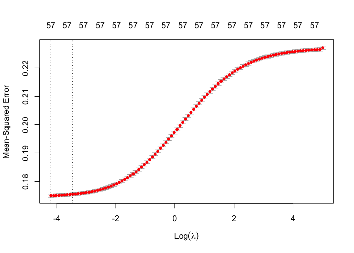

```{r setup, include=FALSE, message = FALSE}
options(scipen = 0, digits = 3)  # controls number of significant digits printed
library(tidyverse)
library(kableExtra)
```

```{r coverpage, out.width = "60%", fig.align='center', echo = FALSE, fig.pos = "H"}

```

\bigskip

\newpage

# Executive Summary

Rocket League is a multi-platform game where players control cars with a rocket booster and aim to score as many goals as possible within 5 minutes using an oversized ball. The ball never leaves the field and is a team game, but for our analysis, we focused on 2 versus 2 player mode. Players have the ability to control the direction, velocity, and rotation of their cars and can jump to hit the ball. This allows players the ability to take shots or control the car to dribble, pass, and block incoming shots.

Our dataset includes random frames of 2 versus 2 player Rocket League games that includes location data of all 4 players, car features, ball position, and whether or not a particular shot resulted in a goal. 

For our analysis, we built an expected goals (xG) model using location data to predict goals for a given frozen game frame. xG is important in that it is an estimator of goals a team is expected to score in the long run. Using our xG model, we explored individual player ability and analyzed the question: are good players good because they use more attempts, or are good players good because they are truly better skilled?

\newpage

# Data Source
[ to write ]

# Data Cleaning
- dropped car features, only used location data
- because we are interested in expected goals and evaluating shot ability, we filtered for shot = true only

# Exploratory Data Analysis
As a first step, we explored the location data to get a sense of the placement of the goal. Based on Figure \@ref(fig:xyfield), it seems that the goal post is located at $(0,5000,0)$.
```{r xyfield, out.width = "100%", fig.cap = "X-Y Field and Shot Outcome", fig.align='center', echo = FALSE, fig.pos = "H"}

```

# Expected Goals Models
We built two expected goals models using logistic regression and boosted trees. Because of the nature of the dataset, we have data about the ball's trajectory, so we can easily compute whether a shot will result in a goal or not. However, for our model, we used position, velocity, angular velocity, and rotation of the shot taker, defender, and teammate to build our model. To train our model, we predicted the outcome of a shot (goal or no goal) for a particular frame. This implies that our xG estimates are for a set of positions of the shot taker, teammate, and defenders. 

## Analysis Goals
- how is xg used in soccer
- why is xg important

## Feature Engineering
We used feature engineering to transform the raw data into features that can be used in supervised learning. 

## Logistic Regression
- discuss how we excluded teammate data? maybe because MLE doesn't converge because of high correlation across variables and the goals variable???
```{r glm-fit}
load("../results/glm_fit.rda")
summary(glm_fit)
```
## Penalized Regressions
```{r ridgecv, out.width = "80%", fig.cap = "Cross Validation for Ridge Regression", fig.align='center', echo = FALSE, fig.pos = "H"}
# 
```
```{r lassocv, out.width = "80%", fig.cap = "Cross Validation for Lasso Regression", fig.align='center', echo = FALSE, fig.pos = "H"}
knitr::include_graphics("../results/lasso-cv-plot.png")
```
## XGBoost
```{r}
load("../results/gbm_fit.Rda")
boost_feature_importance <- read.csv("../results/boost_feature_importance.csv") %>%
  as_tibble() %>%
  select(-c(X))

boost_feature_importance %>%
  kable(format = "latex", row.names = NA, 
        booktabs = TRUE, digits = 2, 
        col.names = c("Variable", "Relative Influence"),
        caption = "Boosting Important Variables") %>%
  kable_styling(position = "center", latex_options = "HOLD_position")
```

## Model Evaluation
```{r, echo=FALSE}
read.csv("../results/xg_model_eval.csv") %>%
  select(-c(X)) %>%
  as_tibble() %>%
  kable(format = "latex", row.names = NA, 
        booktabs = TRUE, digits = 2, 
        col.names = c("Model", "Log Loss"),
        caption = "Model Evaluation") %>%
  kable_styling(position = "center", latex_options = "HOLD_position")


```


# Excess Goals
To extent our Expected Goals model, we measured players' excess goals, or outperformance. Outperformance is given by dividing total goals scored divided by the sum of the player's expected goal probabilities. An outperformance ratio above one suggests the player is a "good" player in the sense that they are a good shooter and are able to make more goals than what is expected based on their location, their opponent's location, and various ball features. 

# Appendix
Subset of locational features used in models
```{r}
data <- read.csv("../results/clean_shot_data.csv") %>%
  select(-c(X, idx)) %>%
  select(-contains("_ang_vel_")) %>%
  select(-contains("rot"))

names(data) %>%
  kable(format = "latex", row.names = NA, 
        booktabs = TRUE, digits = 2, 
        caption = "Subset of Location Features") %>%
  kable_styling(position = "center", latex_options = "HOLD_position")
```